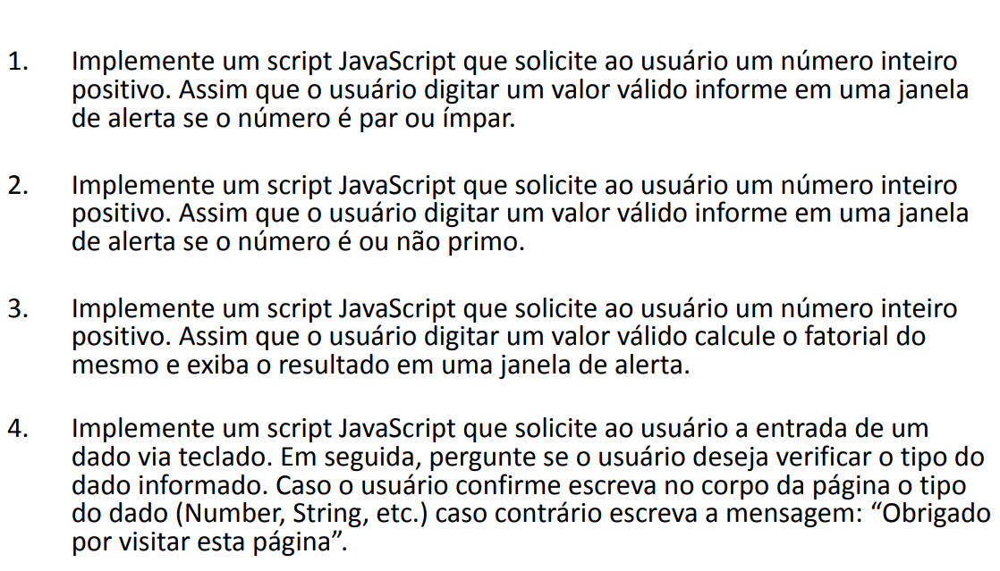
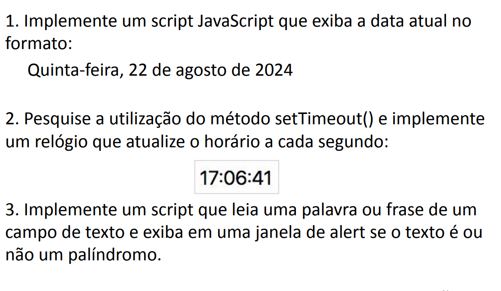

# 🧑‍💻 Laboratório de Engenharia de Software

✨ Atividades práticas desenvolvidas durante as aulas de **Laboratório de Engenharia de Software**. Cada semana traz desafios que exploram conceitos fundamentais de programação e engenharia.

---

## 📅 ATIVIDADES DA SEMANA 01

Nesta semana, você encontrará exercícios que abordam:

1️⃣ Identificação de números pares e ímpares  
2️⃣ Verificação de números primos  
3️⃣ Cálculo de fatoriais  
4️⃣ Interação e validação de dados do usuário

---

## 📅 ATIVIDADES DA SEMANA 02

Desafios focados em manipulação de datas e strings:

1️⃣ Exibição da data atual em um formato amigável  
2️⃣ Relógio dinâmico utilizando `setTimeout()`  
3️⃣ Verificação se uma palavra ou frase é um palíndromo

---

## 📅 ATIVIDADES DA SEMANA 03

Desafios focados em manipulação de datas e strings:

1️⃣ Criação de Lista Ordenada utilizando Array  

## 📅 ATIVIDADES DA SEMANA 04

1️⃣ Criação de Formulário para Aluno e Professor

📝 *As atividades são projetadas para fortalecer habilidades em lógica de programação e aprimorar o domínio de JavaScript. Boa prática!*
